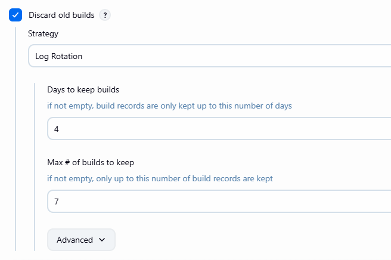
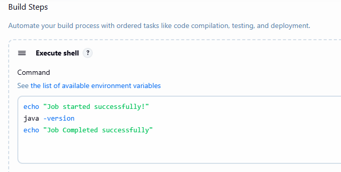

# Free Style Project in Jenkins

- on jenkins dashboard
- click Item -> give name (Jenkins Job1)
- select Free Style Project -> click on OK
- here add description
- check on discard old builds

- scroll last to build step option
- click on Add Build Step select execute Shell

- click on apply and save

- click on Build Now
- You can see bottom left side no of build
- click on #1 
- you can click on console output
- check output for your Job
- if its success means job executed successfully