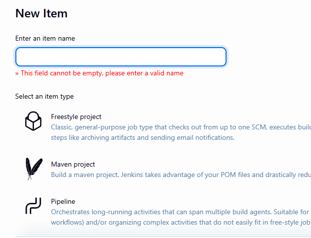

# How to install Plugin in Jenkins

- click on setting icon (manage jenkins)
- plugins
- available plugins 
- search for maven 
- you can see maven integration (check on the box)
- click on install
- scroll and check installion done or not.
- once completed check by clicking on new item
- you can see new option coming for creating maven project

