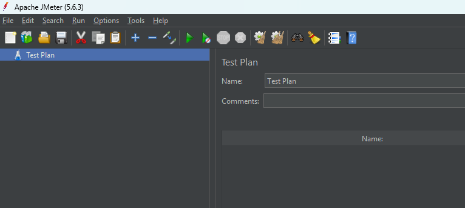
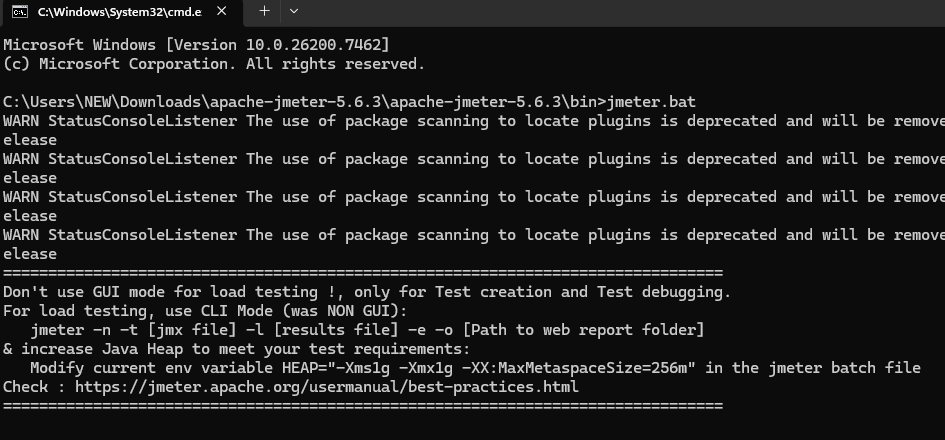
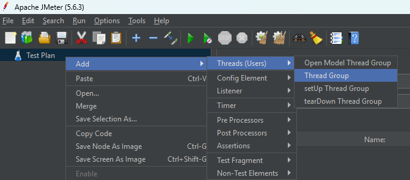
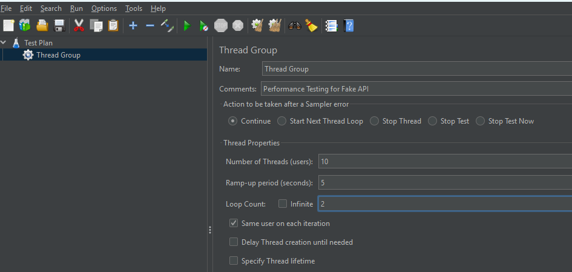
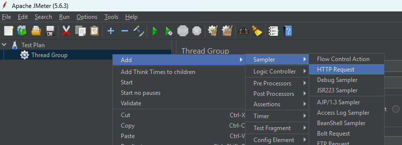
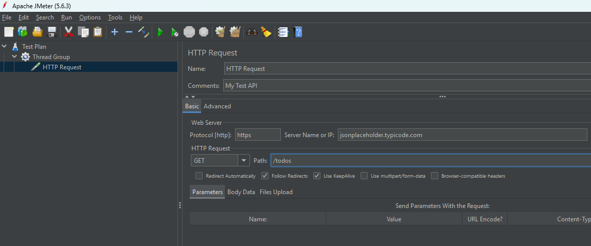
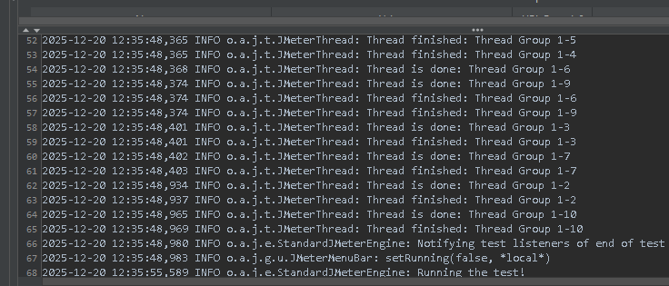
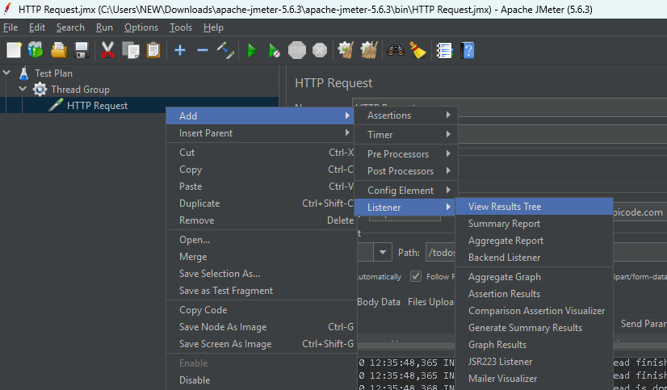
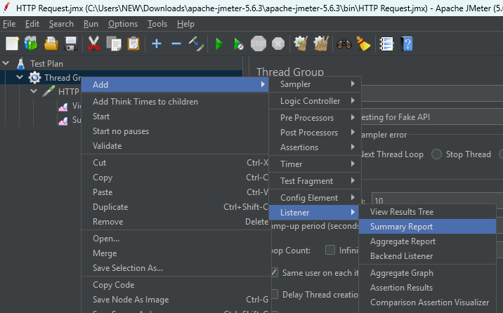
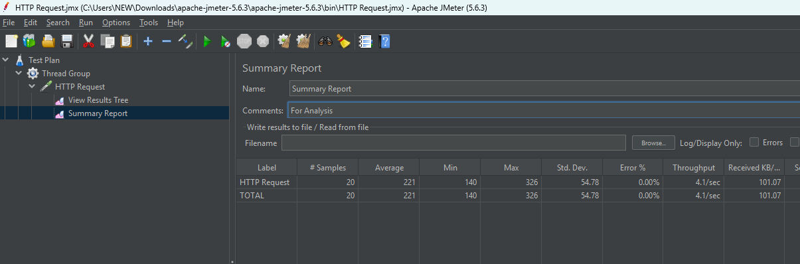

# Setting up Jmeter

- To work with JMeter JDK setuo required
- download JDK using below link and install

[Download JDK](https://www.oracle.com/in/java/technologies/downloads/#java21)
- once JDK is installed check Version

```bash
java -version
```

## Download JMeter

[Download JMetere](https://jmeter.apache.org/download_jmeter.cgi)
- Download from Binaries either TAR or Zip file
- extract
- go to the Bin folder open in CMD or terminal
- run jmeter.bat for windows, jmeter.sh for linux/mac
- jmeter will start



- Keep your Terminal on to work with JMeter



**Implement Performance Testing**









- for checking results click on start icon



- Another way of result check



- Configure View Result Tree


- click on start button and check results, request, response data etc..

- once it is generated you can save reports to file as well.
- click on configure and browse for the file name and save data

## Generate Summary report



- add comment and click on start icon you can see generated summary




