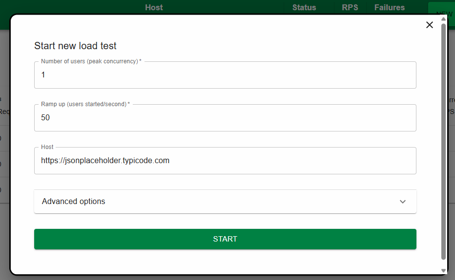
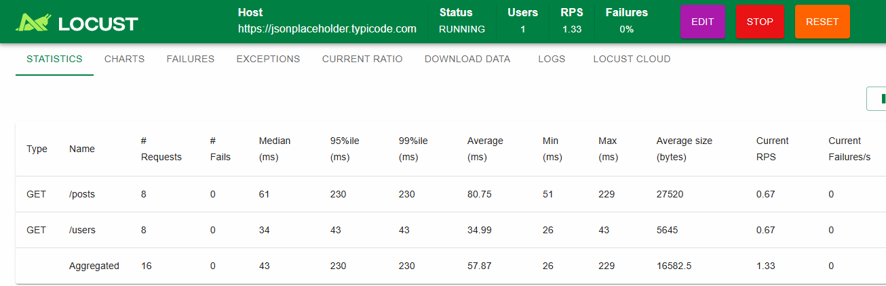

# Stress Testing

- finding out breaking point of application
- increase load that the limit
- short term
- finding out how system behaves under extreme pressure

*e.g. Gradually increase users from 1000 to 50,000 until app crash*

# Soak Testing

- checking stability over a long time
- steady, step by step increase load
- long term
- memory leak, resource issues, performance degradation

*e.g. Run app with 5000 users continuously for 48-72 hours and monitor memory/CPU*

## Setting up Locust Testing

- setting up virtual environment and install locust

```bash
python -m venv venv
venv\Scripts\activate #source venv\bin\activate

pip install locust
locust --version # check version

```

- create locustfile.py file and add some code
- refer document [Locust Pip](https://pypi.org/project/locust/)

- reference code

```py
from locust import HttpUser, task, between

class MyStressTestUser(HttpUser):
    wait_time = between(1, 2)

    @task
    def get_posts_users(self):
        self.client.get("/posts")
        self.client.get("/users")

```

```bash
locust -f locustfile.py
```
- access in browser



- click on start
- check statistics



- check charts, failures, exceptions, current ratio etc...