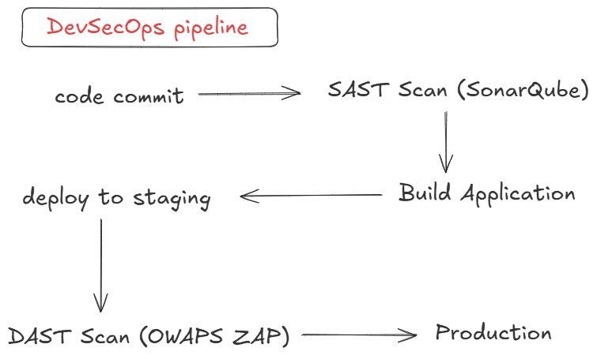

# SAST and DAST

- Both are application Security Testing approaches used in DevSecOps pipelines.

## SAST - Static Application Security Testing

- White Box Testing
- Scans source code, bytecode or binaries
- Find vulnerabilities without runnint the application

### What It can detects

- Hardcoded Secrets
- Insecure auth logic
- Buffer overflow
- code level vulnerabilities
- SQL Injection

### Popular Tools

- SonarQube
- Fortify

### Pros

- find issues early
- exact line of code indentified
- no need to run application

### Cons

- cannot detect problems runtime
- cannot find configuration issues

## DAST - Dynamic Application Security Testing

- Black Box Testing
- Test the running application
- no access to source code

### What It can detects

- SQL Injections (runtime)
- auth issues
- broken access control

### Popular Tools

- OWASP ZAP
- Netsparker

### Pros

- test real world attacks
- find runtime and config issues

### Cons

- requires to run application
- slower
- limited code visibility

# DevSecOps pipeline

