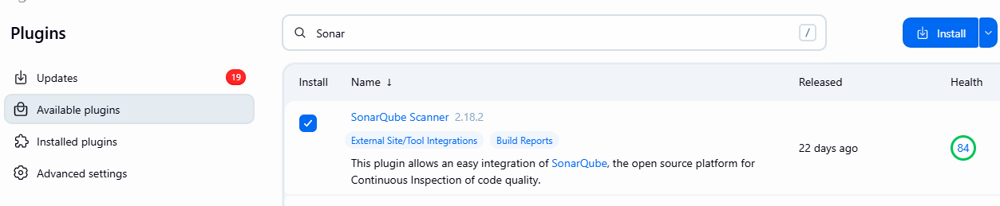
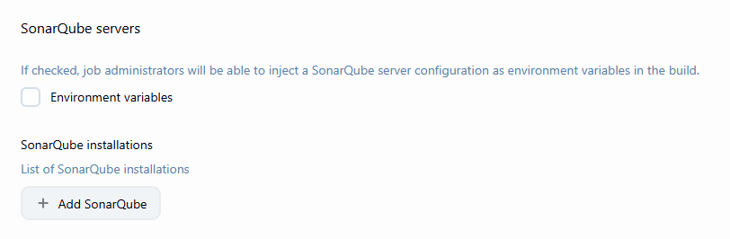
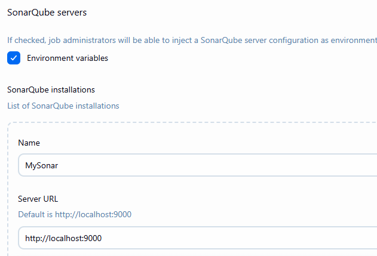
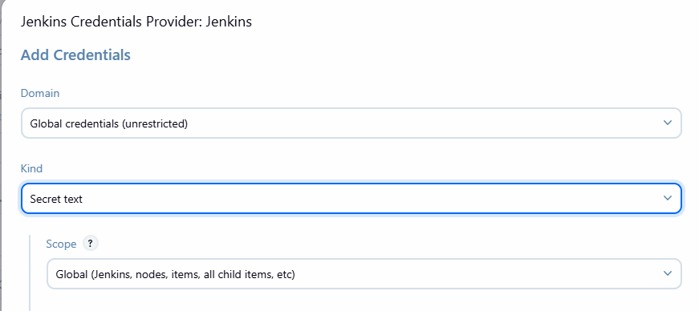
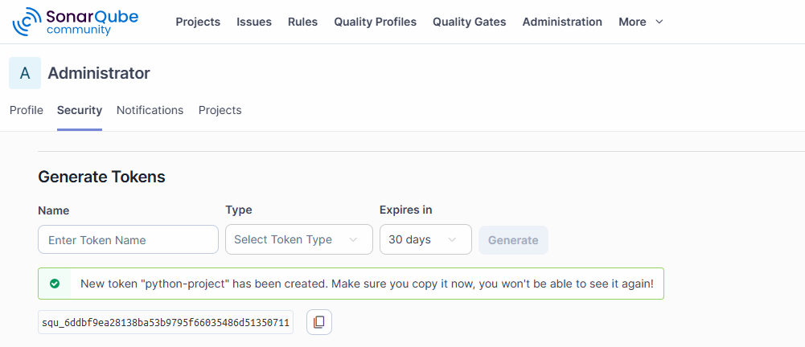
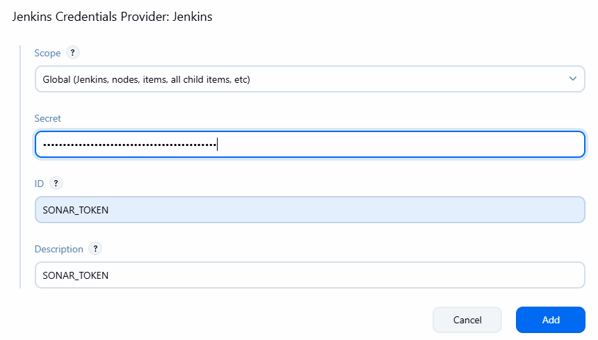
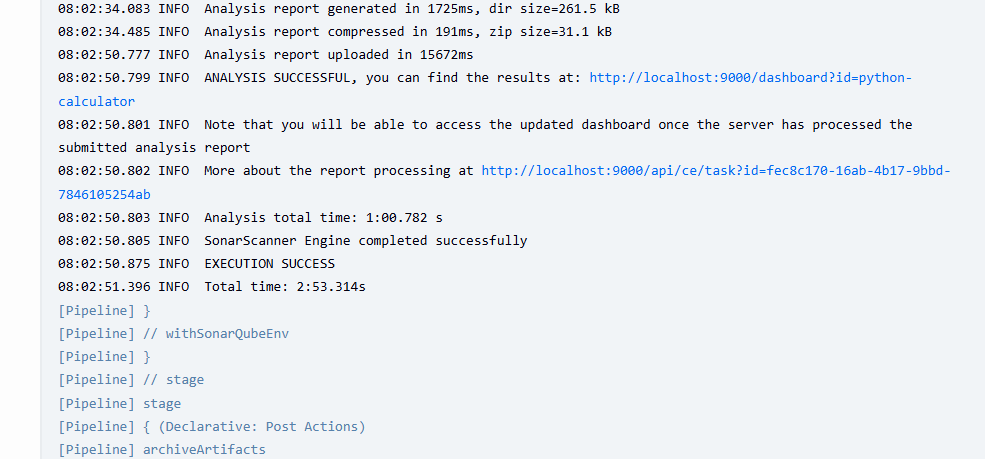
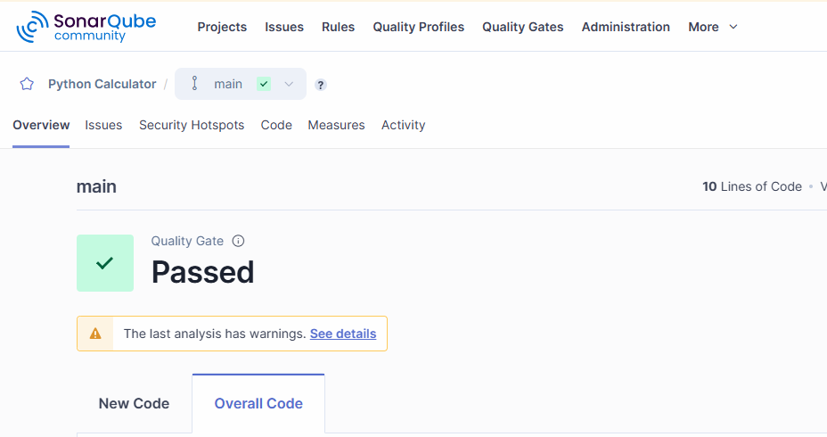

# Jenkins with Sonar Qube Integration

- Run Sonar and Jenkins Together
- like in windows then both should run on windows
- if WSL then both app should run in WSL

1. open wsl

```bash
# check Jenkins status
sudo systemctl status jenkins
# incase if its not running then start
sudo systemctl start jenkins
```
- Login to Jenkins Dashboard
- access it in browser http://localhost:8080/

2. Start SonarQube

- Open Sonar folder and start SonarQube
- Access from http://localhost:9000

```bash
# move to the folder sonarqube/linux/bin/
./sonar.sh start
```
3. Go to Jenkins
    - manage Jenkins
    - plugins -> available pulgins
    - Search for SonarQube Scanner
    - click on Install


4. Configure SonarQube in Jenkins

- manage Jenkins -> System
- SonarQube Servers


- Check on Environment Variables
- click on add SonarQube



- in Generate Auth token
- click on Add -> click on Jenkins



- Generate Token from Sonar Dashboard
- Account -> My Account -> Security Tab -> Generate User Token



- Add that token in Jenkins


- Click on Add Button and then Click on Save

### Let's Create pipeline

- jenkins - Create New Item --> Select Pipeline -> OK
- Add basic Configuration for Pipeline

```groovy
pipeline {
    agent any

    tools {
        sonarScanner 'MySonarScanner'
    }
    environment {
        SONARQUBE_ENV = 'MySonar'
    }

    stages {
        stage('Checkout'){
            steps{
                git url:'https://github.com/sonam-niit/python-calculator-sonar.git',branch:'main'
            }
        }
        stage('Create Virtualenv') {
            steps {
                sh '''
                    python3 -m venv venv
                    . venv/bin/activate
                    pip install --upgrade pip
                    pip install -r requirements.txt
                '''
            }
        }

        stage('Run Tests & Coverage') {
            steps {
                sh '''
                    . venv/bin/activate
                    pytest --cov=app --cov-report=xml
                '''
            }
        }

        stage('SonarQube Analysis') {
            steps {
                withSonarQubeEnv("${SONARQUBE_ENV}") {
                    sh '''
                        . venv/bin/activate
                        sonar-scanner
                    '''
                }
            }
        }
        
        stage('Quality Gate') {
            steps {
                timeout(time:5, unit: 'MINUTES') {
                    waitForQualityGate abortPipeline: true
                }
            }
        }

    }

    post {
        always {
            archiveArtifacts artifacts: 'coverage.xml', allowEmptyArchive: true
        }
        failure {
            echo 'Build Failed due to Quality Gate or test Failure'
        }
        success {
            echo 'Code Quality Check Passed'
        }
    }
}
```

- Save
- Click on Build Now



- you can click on Project Links
- It will be redirected to Sonar dashboard




- Incase If you want to use Jenkins Sonar-Scanner
- then install Plugin for Jenkins Scanner
- ManageJenkins -> Tools -> Sonarqube Scanner Installation -> Add New
- Give Some Name, check on install automatically and Save

- Usually jenkins detect scanner sutomatically but incase if its not detecting 
- then use

```groovy
tools {
    sonarScanner 'MySonarScanner'
}

```

