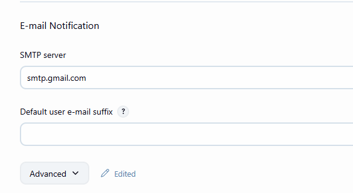
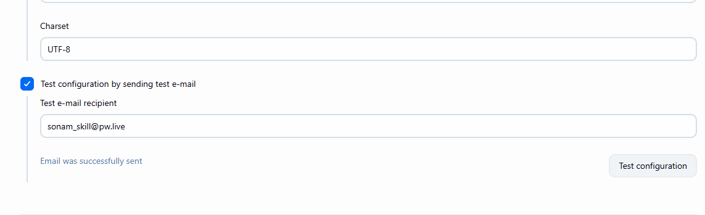
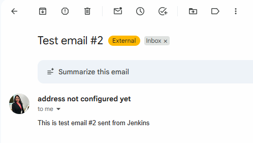

# Setting up Mannual Approval in Jenkins

- Create Jenkins Pipeline include script code

```groovy
pipeline {
    agent any

    stages {
        stage('Build') {
            steps {
                echo 'This is My Build Stage'
            }
        }
        stage('Test') {
            steps {
                echo 'This is My Build Stage'
            }
        }
        stage('Approval') {
            steps {
                timeout(time:15,unit:'MINUTES'){
                    input message: 'Do you want to approve the deployment?', ok:'yes'
                }
            }
        }
        stage('Deplpoyement') {
            steps {
                echo 'Application Deployed'
            }
        }
    }
}

```
- Save
- Build Now --> Check in console Output, you can approve or abort the process.

# Send an email for Approval pipeline

- you need to configure email Notification
- Manage Jenkins -> System -> Email Notification



- click on Advanced


- Generate App Password for your Email by accessing myaccount.gmail.com
- Search For App Password and create

- Test Email


- check you email that mail received or not


- Let's Configure the Pipeline to receive an approval mail

```groovy
pipeline {
    agent any

    stages {
        stage('Build') {
            steps {
                echo 'This is My Build Stage'
            }
        }
        stage('Test') {
            steps {
                echo 'This is My Build Stage'
            }
        }
        //Update This Code
        stage('Email For Approval') {
            steps {
                mail to: 'sonam_skills@pw.live',
                subject: "Approval needed for Production Deployment",
                body: """
                Build #${env.BUILD_NUMBER} is ready for Approval
                
                click on the following link to approve
                ${env.BUILD_URL}
                
                Login and click "Proceed" in approval Stage
                """
            }
        }
        stage('Approval') {
            steps {
                timeout(time:15,unit:'MINUTES'){
                    input message: 'Do you want to approve the deployment?', ok:'yes'
                }
            }
        }
        stage('Deplpoyement') {
            steps {
                echo 'Application Deployed'
            }
        }
    }
}

```
- Build Pipeline
- Check your email and you will be redirected to approval page