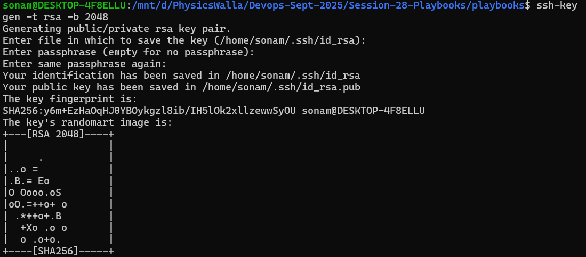

# Generate SSH Key for Password Less Login 

- ssh-keygen -t rsa -b 2048

- generate key
- showing default location- if you want use same default location just press enter
- enter passphrase which is password
- reenter and proceed



## Use ssh-copy-id with AWS EC2

- ssh-copy-id ubuntu@<ip_address_of_your_host>
- ssh ubuntu@ip_address (it will connect with instance directly)

**If Above option not working**

- cat ~/.ssh/id_rsa.pub
- copy key content

- connect with EC2 using pem once
```bash
mkdir -p ~/.ssh
chmod 700 ~/.ssh
vi ~/.ssh/authorized_keys # paste content and save
chmod 600 ~/.ssh/authorized_keys
exit
```
- from local system
- ssh username@host_name (you can connect)