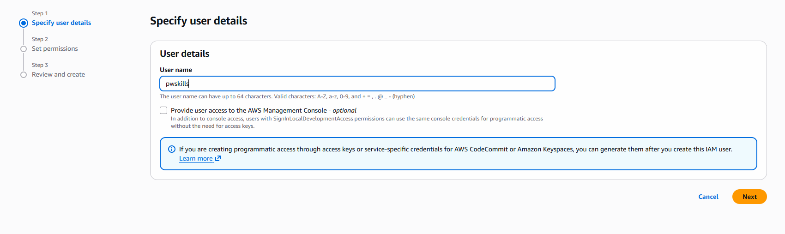
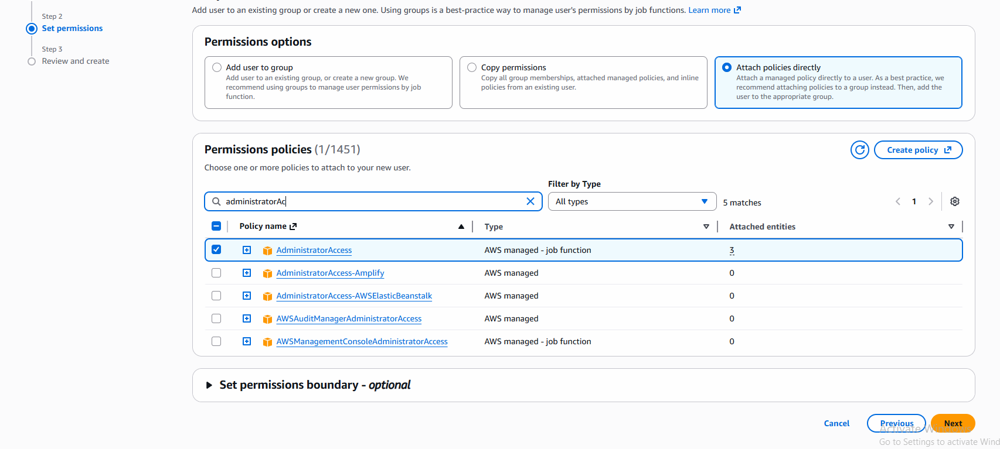
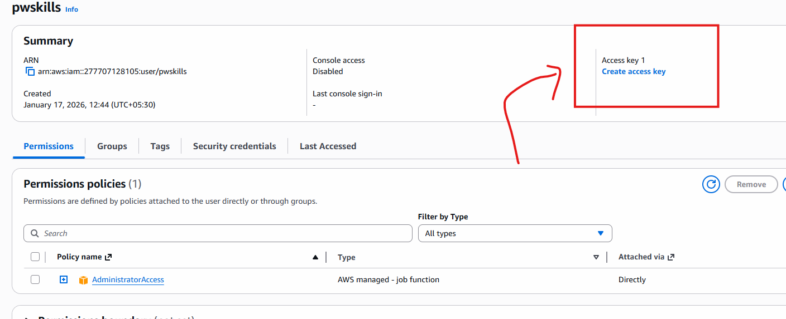
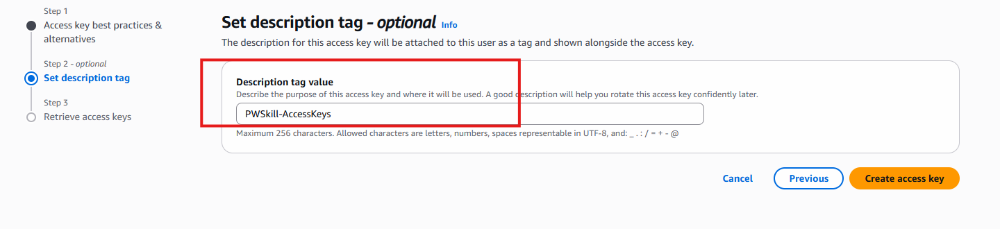
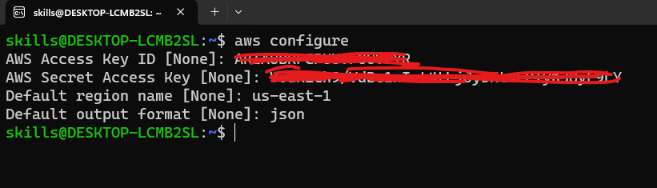

# Dynamic Inventory

- Dynamic Inventory automatically fetches hosts from cloud providers or APIs using static inventory.

- The aws_ec2 dynamic inventory plugin makes API calls to AWS to get a list of inventory hosts from Amazon Web Services EC2 in the run time. It gives the EC2 instance details dynamically to manage the AWS infrastructure.

- for Authentication Let's Do AWS CLI configuration

[Documentation for AWS CLI](https://docs.aws.amazon.com/cli/latest/userguide/getting-started-install.html)

```bash
curl "https://awscli.amazonaws.com/awscli-exe-linux-x86_64.zip" -o "awscliv2.zip" # Download
sudo apt install unzip # install unzip
unzip awscliv2.zip # unzip the folder
sudo ./aws/install # this will install
aws --version # verify installation
```

- Now go to AWS Console --> Login
- Search For IAM service
- click on the same
- click on Users 
- create User

- click on next

- click on next and create User


- click on your Username and You can see below Screen


- click create Access Key


- click on Next

- Give Description  and click on next



- click on create Access Keys


- make Sure you download CSV file and Copy Keys
- Because its not visible again once you click on done

## Now Configure AWS CLI in my System

- open wsl

```bash
aws configure
```


### Verify

```bash
aws configure list
aws sts get-caller-identity # You get Account Details
```

## Create Dynamic Inventory

[Reference Link Documentation](https://docs.ansible.com/projects/ansible/latest/collections/amazon/aws/docsite/aws_ec2_guide.html)

- create aws_ec2.yml as shown here
- this is our dynamic inventory created.

```bash
ansible-inventory -i aws_ec2.yml --graph
ansible-inventory -i aws_ec2.yml --list # generate inventory List

# incase if you are getting warning while generating inventory means few dependency missing

# install boto3 and botocore

sudo apt install python3-boto3 -y
sudo apt install python3-botocore -y

python3 -m pip show boto3 # show boto3 version

# after verify check again
ansible-inventory -i aws_ec2.yml --graph
```