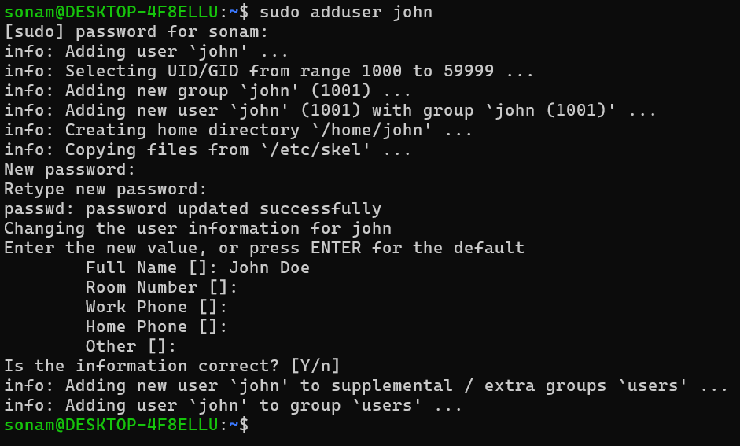
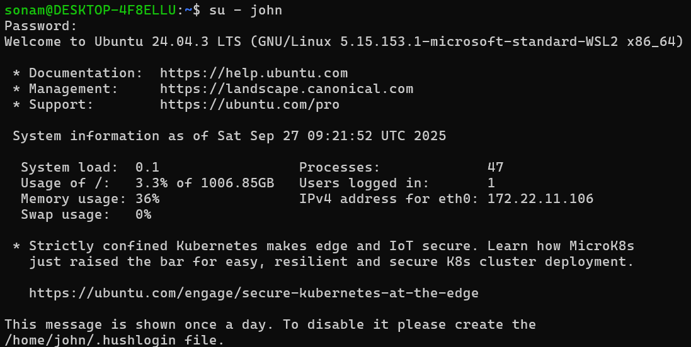

# User management in Linux

1. User Creation

    - use command: sudo adduser john
    - create user named john
    - prompts for password so enter password
    - add user details and your will be created

    

2. let's try to switch user

    - su - john
    - prompt for password (enter john's password)
    - now you are connected with john user account

    

3. usermod:  changing permission to existing user
    - sudo usermod -l johnny john (change username)
    - sudo usermod -aG sudo johnny (add user to sudo group)
    - set user expiry
    - sudo usermod -e 2025-12-31 johnny

4. List all Users

    - cat /etc/passwd

    **Explanation**
    rohit:x:0:1001::/home/rohit:/bin/bash
    username:password_placehoder:UID:GID::home_directory:shell

5. check groups of Users:

    - groups johnny

6. Remove Users:
    - sudo deluser --romeve-home johnny (remove with home directory)
    - sudo deluser johhn (just delete User)

