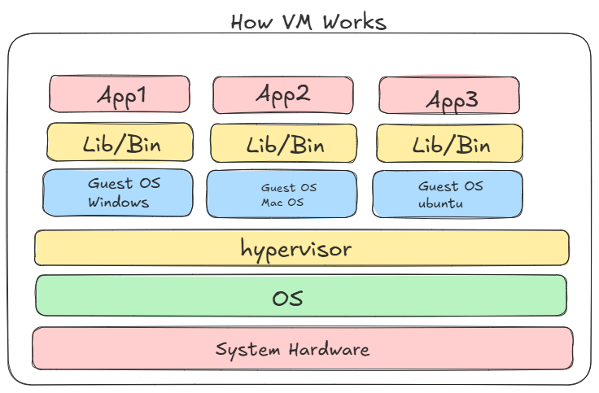
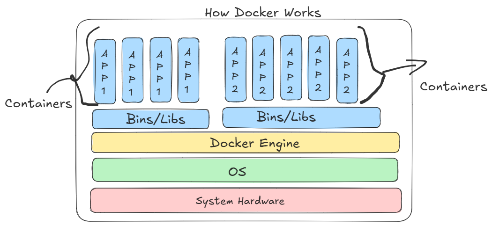

# Docker Fundamentals

- How VM works?


- how Containers works?


## Dcoker Components

1. Docker Image:
    - Read only blue print of application
    - it contains os libraries, dependencies, code and configrations
    - ubuntu, node:20, nginx:latest
    - download it as template and just use it.

    **Where to see images**
    - https://hub.docker.com/
    - search for any image and check details

2. Docker Containers:
    - A running instance of image
    - image (Template) - blueprint
    - container: running image

## How to start with Docker

- Install docker in Linux/Ubuntu
[Reference Link](https://docs.docker.com/engine/install/ubuntu/)

```bash
# update apt repo
# Add Docker's official GPG key:
sudo apt update
sudo apt install ca-certificates curl
sudo install -m 0755 -d /etc/apt/keyrings
sudo curl -fsSL https://download.docker.com/linux/ubuntu/gpg -o /etc/apt/keyrings/docker.asc
sudo chmod a+r /etc/apt/keyrings/docker.asc

# Add the repository to Apt sources:
sudo tee /etc/apt/sources.list.d/docker.sources <<EOF
Types: deb
URIs: https://download.docker.com/linux/ubuntu
Suites: $(. /etc/os-release && echo "${UBUNTU_CODENAME:-$VERSION_CODENAME}")
Components: stable
Signed-By: /etc/apt/keyrings/docker.asc
EOF

sudo apt update

sudo apt install docker-ce docker-ce-cli containerd.io docker-buildx-plugin docker-compose-plugin

sudo systemctl status docker
sudo systemctl start docker

docker --version

sudo docker version # where you can see client servr details

```

# For windows and Mac users can download Docker Desktop

[Windows Set up](https://docs.docker.com/desktop/setup/install/windows-install/)

[Mac Set up](https://docs.docker.com/desktop/setup/install/mac-install/)

## Undesratand Command Execution

```bash
sudo docker run hello-world
# hello-world is the images
# if image is not present locally will downloads from dockerhub
# and container executed you can see output and its exited

sudo docker ps # see running containers
sudo docker ps -a # see all containers
# here you can see hello-world image container in exited state

sudo docker rm <name_od_container> #angry_heyrovsky
# See pulled images
sudo docker images
# pull images
sudo docker pull mysql
sudo docker images
sudo docker rmi mysql # remove images
```
## run one more images

```bash
docker run -d --name myapp -p 8081:80 docker/getting-started

```
- run will run image as container
- if you give no name to your container then it will automatically assigns a name
- if you want to give a name use --name flag to give container name

- -d to run container in background (detached mode)
- -p port number 8081:80
- first port  is host port (system port)
- 2nd port is docker internal port (which port is req for your app)
- once container is started i can access it in browser on loclahost:8081

```bash
sudo docker ps # see running container # localhost:8081/
# remove running container then stop first and remove
sudo docker stop myapp
sudo docker ps -a # you can see container is exited state
sudo docker rm myapp
```

## Where to see docker logs

```bash
sudo docker run -d --name myapp -p 8081:80 docker/getting-started
sudo docker logs # check all logs for troubleshoot

# Direct remove running container
sudo docker rm -f myapp
# it will stop and remove container forcefully
```

## Work with mysql container

[Reference Link](https://hub.docker.com/_/mysql)

```bash
sudo docker run --name mysql-container -e MYSQL_ROOT_PASSWORD=123456 -d mysql:latest
# :latest where you can put version
# here no need of port because it will internally use 3306
# DB no need to expose as we don't wnat to access from browser
sudo docker ps # check container status if up you can use
# -e for environment variable
sudo docker logs mysql-container
# we need to go inside the container to access database
sudo docker exec -it mysql-container bash
# open bash of container
mysql -u root -p
# ask you to enter password 123456
# now you can access DB
```
```sql
create database pw;
use pw;
create table student (id int, name varchar(20));
insert into student (id,name) values (1, 'Alex');
select * from student;
exit; -- exit from DB
```
- again exit to exit from container

### Practice Task

- run jenkins as container 

```bash
sudo docker run -d --name jenkins -p 8080:8080 jenkins/jenkins

sudo docker ps
# if up
# access in browser localhost:8080 
# your jenkins running in container
```