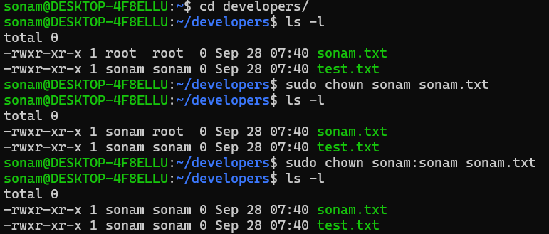

# System Administrator Commands

- systemctl is the main command in system based linux systems
- control the system service and system state.

```bash
sudo apt install apache2 -y # its a package with that we can start apcahe server
sudo systemctl start apache2 # start apache service
sudo systemctl status apache2 # check server is running or not
# if active then default sercer running on port 80 so go to the browser
# check localhost ,you can see default page of html

sudo systemctl enable apache2 
# start the service automatically when you system reboot
sudo systemctl stop apache2 # stop apache2 service

sudo systemctl disable apache2 # disable service
```

## Setting up a permissoion

- r(read) - 4
- w(write) - 2
- x(execute) - 1

```bash
cd developers
touch test.txt
ls -l #check the current permisson
chmod 755 test.txt # change permission
# 7 - rwx - for Owner
# 5 - r_x - for groups
# 5 - r_x - for others
```

## Setting permission symbolic way

```bash
chmod u+x test.txt # add owner execute permisson
chmod o-w test.txt # remove others write permission
chmod g+x test.txt # add execute permission to group
ls -l # verify permission
```

## Change the ownership for a file

- use chown command
- just change use with username
- also wants to change group name as well use username:groupname
- check below reference.



```bash
sudo chown :root sonam.txt # changing just group
```