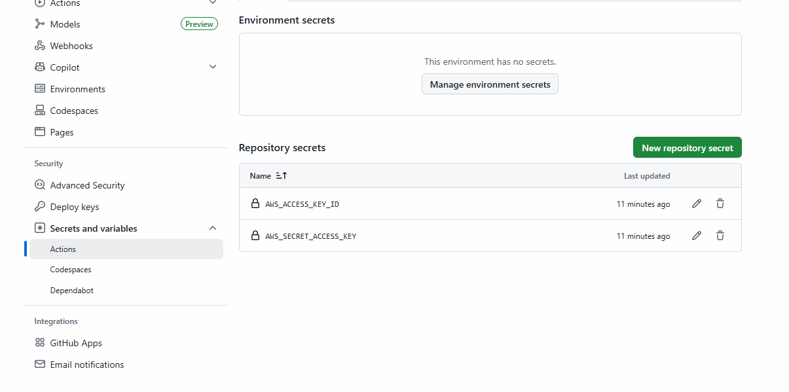

# Automated Cleanup

- create main.tf and variables.tf as show in cleanup folder
- create resources

```bash
terraform init
terraform apply --auto-approve

```
# To destroy from Local Cron Job

- create one script named destroy.sh

```sh
#!/bin/bash

cd /mnt/e/Sonam-Soni/PhysicsWalla/Batches/DevOps/Devops-Sept-2025/Session-41-workspace,cost-optimization/cleanup-pipeline
terraform destroy --auto-approve

```

- make sure to make this script executable
- chmod +x destroy.sh

- use crontab -e
- edit file : 0 23 * * * filelocation/destroy.sh >> /home/sonam/result.log >2&1

## For automated pipeline create project structure like this

[Github Link](https://github.com/sonam-niit/Terraform-CICD)

- write pipeline and set secrets

