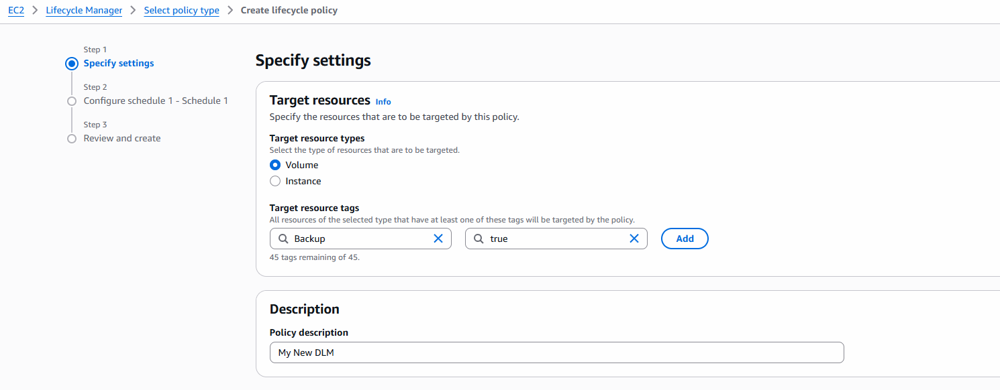
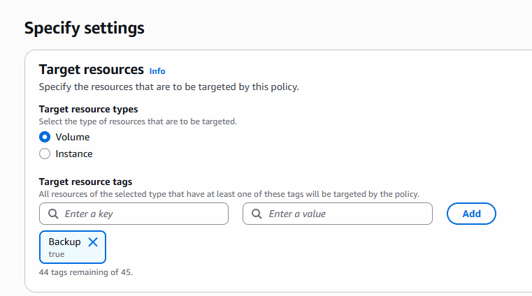
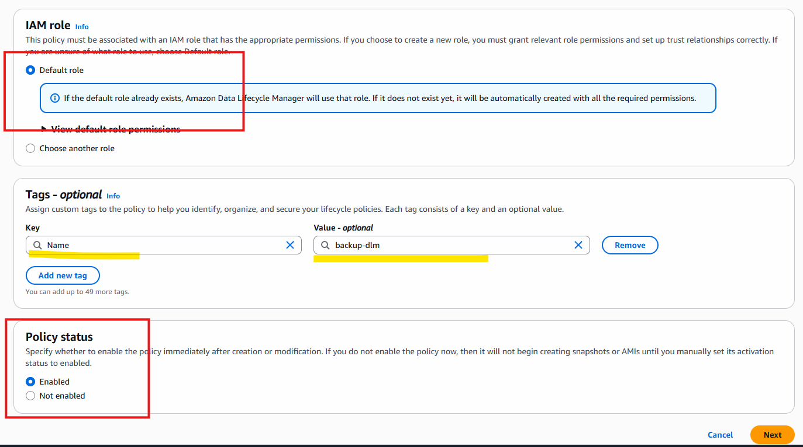
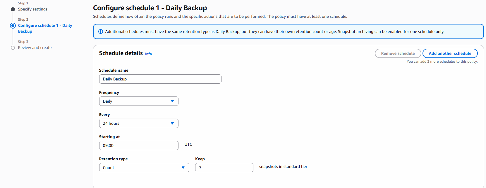

# Backups

- Disaster Recovery Backups are very important
- EBS Snapshots
- EBS: Elastic Block Store - storage provided by EC2 instance
- used to attach extra space to EC2 instance

- By default what volume is coming with EC2 that is deleted with instance, but its backup we can manage using snapshots.

## How to Create Snapshots

- EC2- EBS- Snapshots --> create Snapshot -> select volume backup you want to take -> create Backup
- give tags: Name -> backup-instance-volume --> create snapshot

- After this if you delete instance still backup remains there.
- if you want to restore create volume -> select the snapshot for backup 
- this volume you can attach to your new instance

- select volume --> attach volume --> select instance
- make sure volume must be created in same AZ where instance located then only you can attach

*Once volume created you can't change its AZ*

## How to create Extra Volume

- create new Volume (SSD)
- give all values default - select correct AZ
- give tags
- Name: Extra Vol
- attach to your instance
- later on if you want to se its attached or not

- go to instance --> storage tab and you can see 2 different volumes
- on is default and another one is your created.

## How to Delete

- select volume and delete  the same
- if volume is attached to some instance you can't delete it
- first make sure you detach the same and then delete.

## EBS Snapshot Automation

- Best and recommended way for Backup
- AWS DLM (Data Lifecycle Manager)

**What it is doing?**

- automatically creates Backup
- Retails
- deletes old EBS snapshots

1. go to AWS Console -> EC2 -> EBS -> lifecycle Manager
2. select default policy -> next
3. selectn volume or instance volume for backup
4. add values for key value pair to match volumes for Backup

- after typing make sure you add tag 

- click on next

- click on create

**My Fully Automated Backup System is Configured**

-  Any volume which is having tag named Backup and value is true will be automatically backedup using this policy.

