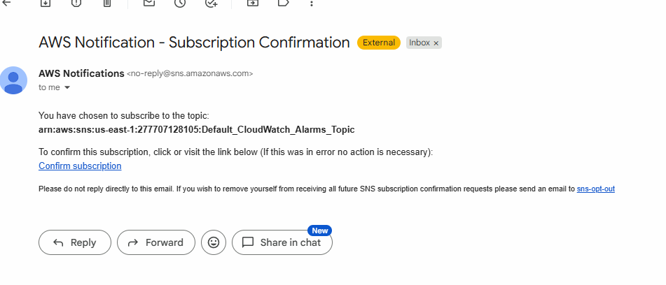
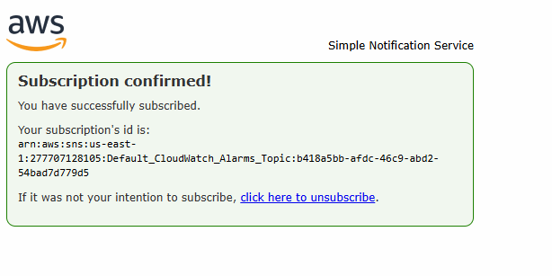
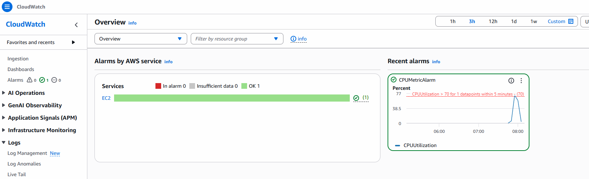
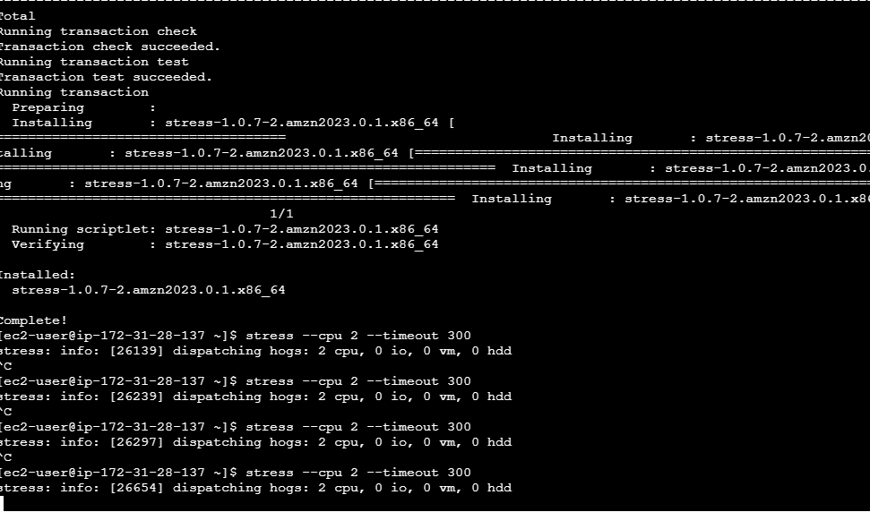
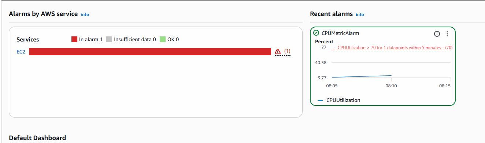

# Implement CloudWatch Alarm

- login to AWS Console
- create 1 LinuxVm (instance) using aws linux image only

- Go to Cloudwatch
- Alarms -> create alarm
- Choose Metric --> Select EC2 -> click on that -> Per Instance Metric -> select
- Below Search for CPU utilization
- click next and here you need to configure
- instance id: add your instance id
- selct Metrics, define condition
- average CPU Utilization unit (% by default)
- statics -> average -> greater than 70
- net option see SNS (this is for notification)
- create new topic (give name and emailid)
- when you click on create topic
- you must received and email for confirmation



- go to your email and click on confrmation link.



- go to alarm

- give alarm name and create Alarm
- go to cloud watch dashboard



- increse stress on EC2 instance by connect and execute below commands

```bash
sudo yum install stress -y
stress --cpu 2 --timeout 300

# Runs 2 CPU for 5 minutes
```


- it will go in In Alarm state you must receive an email 



- again stop the stress and it will be go back to OK state