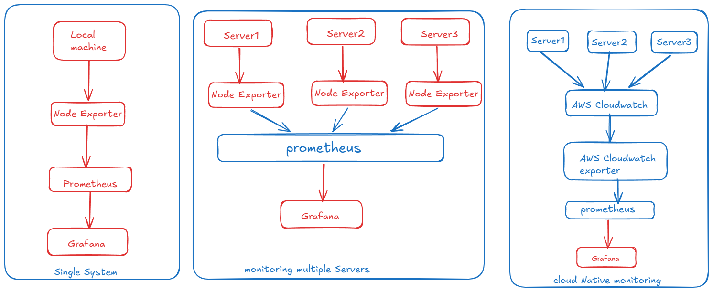

# Create prometehus Setup

- Download prometheus

[Download Prometheus](https://prometheus.io/download/)

- extract files, add folder to some place like tools
- rename folder to prometheus.
- open wsl: open folder location inside WSL
- ls : check you can see 3 files prometheus,promtool, prometheus.yml

```bash
cd /mnt/e/Tools/prometheus
ls
```

- prometheus.yml

```yml
# my global config
global:
  scrape_interval: 15s
  evaluation_interval: 15s

scrape_configs:
  - job_name: "prometheus"
    static_configs:
      - targets: ["localhost:9090"]
        labels:
          app: "prometheus"
```

- start prometheus server

```bash
./prometheus 
# check in Browser localhost:9090
```
- in query tab type: up
- execute (if its 1 means server is up, 0 means its down)
- you can also check using this link:
    + http://localhost:9090/targets

### Let's use Node Exporter for System(Machine) metrics

- download node exporter from the same link where we downloaded prometheus
- extract and put it under tools folder
- cd /mnt/e/Tools/node_exporter
- ./node_exporter (run this)

### Let's connect with prometheus

- go to prometheus terminal
- stop using ctrl+c 
- edit yml file again to add node exporter targets

```yml
# my global config
global:
  scrape_interval: 15s
  evaluation_interval: 15s

scrape_configs:
  - job_name: "prometheus"
    static_configs:
      - targets: ["localhost:9090"]
        labels:
          app: "prometheus"

  - job_name: "node"
    static_configs:
       - targets: ["localhost:9100"]
```
- save and start prometheus again
- check targets in browser
- you can see node-exporter is also up
- check using up command and you can see 2 targets are up

### Query System Metrics

- CPU Usage: rate(node_cpu_seconds_total[1m])
- Memory Usage: node_memory_MemAvailable_bytes (check graph usage with diffrent time)
- Disk Usage: node_filesystem_size_bytes

*Note*

- http://localhost:9100/metrics (this is the node exporter matrics url which is exporting tha data)
- which we are collecting in Prometheus
- we can query it using prometheus to do infra monitoring.


## Grafana (Visualizatin Dashboard)

[Download Grafana](https://grafana.com/grafana/download?edition=oss)

```bash
sudo apt-get install -y adduser libfontconfig1 musl
wget https://dl.grafana.com/grafana/release/12.4.0/grafana_12.4.0_22325204712_linux_amd64.deb
sudo dpkg -i grafana_12.4.0_22325204712_linux_amd64.deb
# install grafana

sudo /bin/systemctl daemon-reload
sudo /bin/systemctl enable grafana-server
sudo /bin/systemctl start grafana-server
sudo /bin/systemctl status grafana-server
```
- if running then check in Browser: localhost:3000
- default cred: admin / admin
- skip change password option and you will be redirected to grafana dashboard

*incase if you want to change port (sudo nano /etc/grafana/grafana.ini)*

- on grafana dashboard
- connection - add new connection -> search for prometheus  -> select it
- add datasource: give name prometheus
- url: http://localhost:9090
- save+test
- if test done successful you can see (Successfully queried the Prometheus API.)


### Creating dashboard

- click on Dashboard -> new dashboard
- create dashboard -> add visualization -> select prometheus
- you can see panel to edit


## Multi Cloud monitoring

