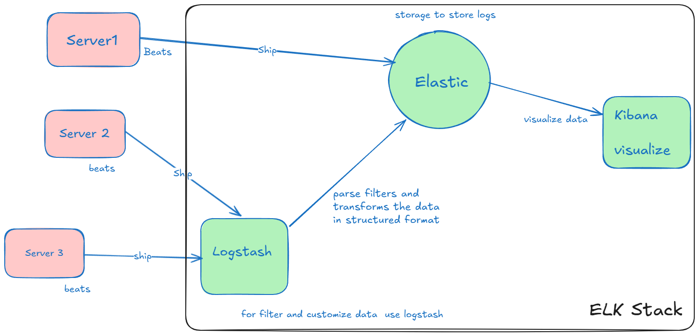
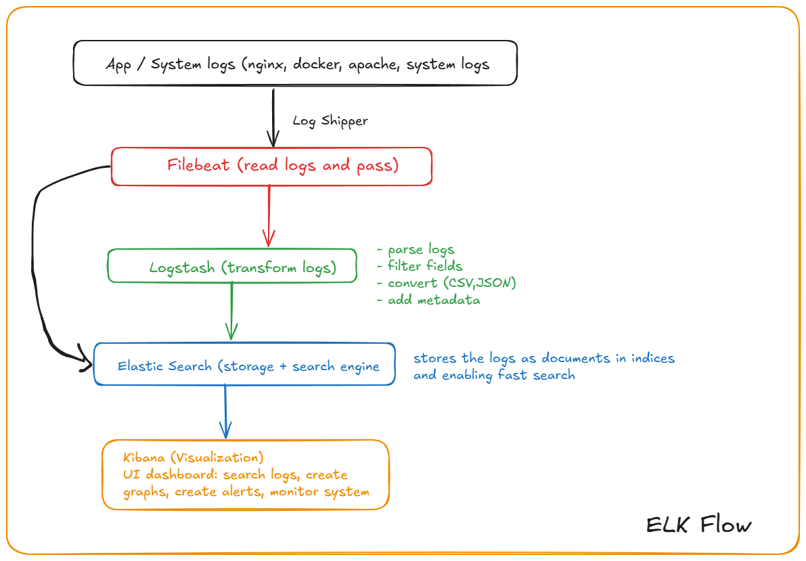
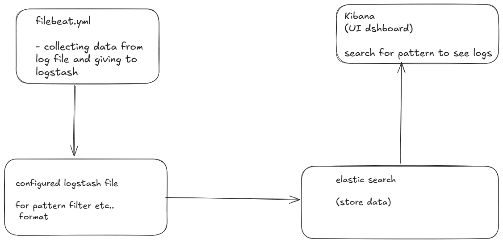

# Logging and Log management

- ELK (elastic search), logstash, Kibana



- ELK Flow



### Setup ELK 

- install elastic Search

```bash
wget https://artifacts.elastic.co/downloads/elasticsearch/elasticsearch-9.3.1-linux-x86_64.tar.gz
wget https://artifacts.elastic.co/downloads/elasticsearch/elasticsearch-9.3.1-linux-x86_64.tar.gz.sha512
shasum -a 512 -c elasticsearch-9.3.1-linux-x86_64.tar.gz.sha512
tar -xzf elasticsearch-9.3.1-linux-x86_64.tar.gz
cd elasticsearch-9.3.1/

sudo systemctl start elasticsearch
sudo systemctl enable elasticsearch

curl localhost:9200 # check in browser as well
```

- install Kibana

```bash
curl -O https://artifacts.elastic.co/downloads/kibana/kibana-9.3.1-darwin-x86_64.tar.gz
curl https://artifacts.elastic.co/downloads/kibana/kibana-9.3.1-darwin-x86_64.tar.gz.sha512 | shasum -a 512 -c -
tar -xzf kibana-9.3.1-darwin-x86_64.tar.gz
cd kibana-9.3.1/

sudo systemctl start kibana
# browser localhost:5601
```

- install Logstash

```bash
wget -qO - https://artifacts.elastic.co/GPG-KEY-elasticsearch | sudo gpg --dearmor -o /usr/share/keyrings/elastic-keyring.gpg

sudo apt-get install apt-transport-https

echo "deb [signed-by=/usr/share/keyrings/elastic-keyring.gpg] https://artifacts.elastic.co/packages/9.x/apt stable main" | sudo tee -a /etc/apt/sources.list.d/elastic-9.x.list

sudo apt-get update && sudo apt-get install logstash
```

- install filebeat

```bash
curl -L -O https://artifacts.elastic.co/downloads/beats/filebeat/filebeat-9.3.1-amd64.deb
sudo dpkg -i filebeat-9.3.1-amd64.deb
```
- we will use app.log file generated earlier for Analyze logs

### Configure Logstash

- sudo nano /etc/logstash/conf.d/demo.conf

```conf
input {
    beats {
        port => "5044"
    }
}
# filter {
#
# }
output {
    elasticsearch {
        hosts => ["http://localhost:9200"]
        index => "demo-logs-%{+YYYY.MM.dd}"
    }
}
```
- start logstash: sudo systemctl start logstash

### Configure Filebeat

- sudo nano /etc/filebeat/filebeat.yml

```yml
filebeat.inputs:
- type: log
  enalbed: true
  paths:
    - /system.log
output.logstash:
  hosts: ["localhost:5044"]
```
- start filebeat: sudo systemctl start filebeat

### Verify logs in Elastic Search

- curl localhost:9200/_cat/indices?v (you can see demo logs)

### to get them in Kibana

- access dashboard: localhost:5601
- stack Management -> create pattern (demo-logs*)
- click on discover (you can see all logs starting with demo-logs)

### Config process

