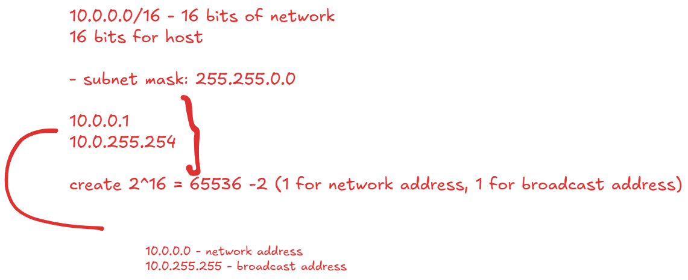
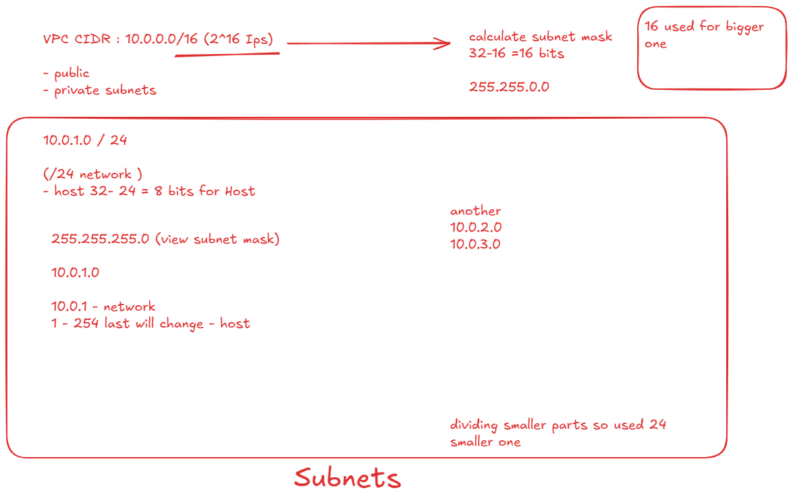
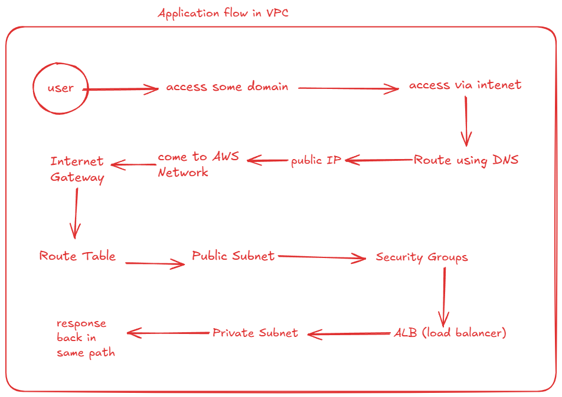

# VPC (Virtual Private Cloud)

- own private cloud (data center) created inside AWS
- isolated network to launch EC2, RDS resources

1. CIDR block:
    - define Ip range
    - 10.0.0.0/16

2. Subnets:
    - small network inside VPC
    - 2 types of subnet
        + private:
            - no direct internet connect
            - connected internally for DB and backend servers
        + public:
            - has internet
            - used for load balancers
    - 10.0.1.0/24 => public
    - 10.0.2.0/24 => Private

    

3. Routing table:
    - control route traffic

4. Internet Gateway (IGW):
    - allows communication between vpc and internet
    - attached to VPC

