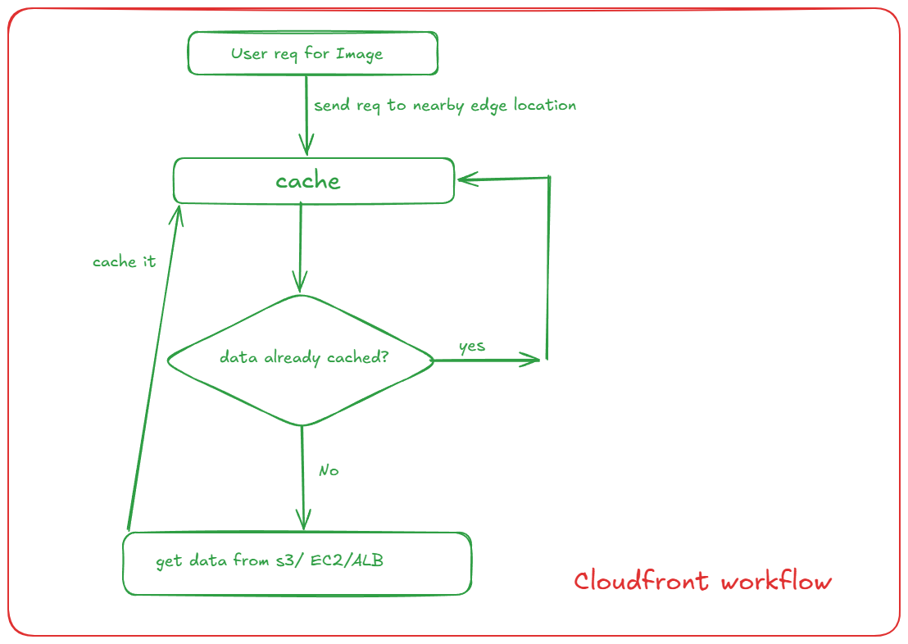

# CloudFront

- global CDN service
- content delivery network

- stores copies of you content in its edge location(worldwide servers)
- delivers content from nearby location

## How Cloudfront Works



- it is used to cache the data like
    + css/js libraries
    + images
    + videos

- its not good for login APIs, Payment APIs, Profile APIs

## Let's implement

- create Origin 
    + create s3 bucket (simple-portfolio-sonam)
    + enable encryption, uncheck block all public access
    + confirm all settings
    + create bucket
    + upload one index.html file to bucket
    + bucket -> permission -> policy -> edit
    + generate policy to give getObject permission from policy generator
    + https://awspolicygen.s3.amazonaws.com/policygen.html
    
```json
{
  "Version": "2012-10-17",
  "Statement": [
    {
      "Sid": "Statement1",
      "Effect": "Allow",
      "Principal": "*",
      "Action": [
        "s3:GetObject"
      ],
      "Resource": "arn:aws:s3:::amzn-sonam-portfolio/*"
    //   add your bucket ARN here followed by /*
    }
  ]
}
```

- now bucket -> properties -> scroll to last
- static site hosting -> enable -> doc (index.html)
- you will get one link to access the website but this is not secure
- if you trigger this everytime it will trigger s3 bucket

## let's Deploy using cloudfront

- open cloudfront -> click on create distribution
- select free distribution
- select single website or app
- skip domain part
- specify origin
- select s3 
- enter static endpoint (select by choosing bucket make sure you select endpoint)
- go with recommended settings and click on next
- create distribution
- usually it takes 3-4 minutes to up the distribution and then you can access it via Distribution domain name
- this is secure and also providing fast result the direct access.