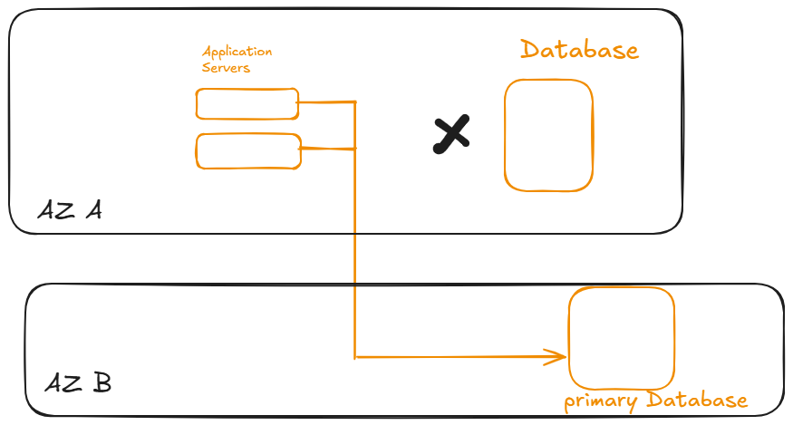
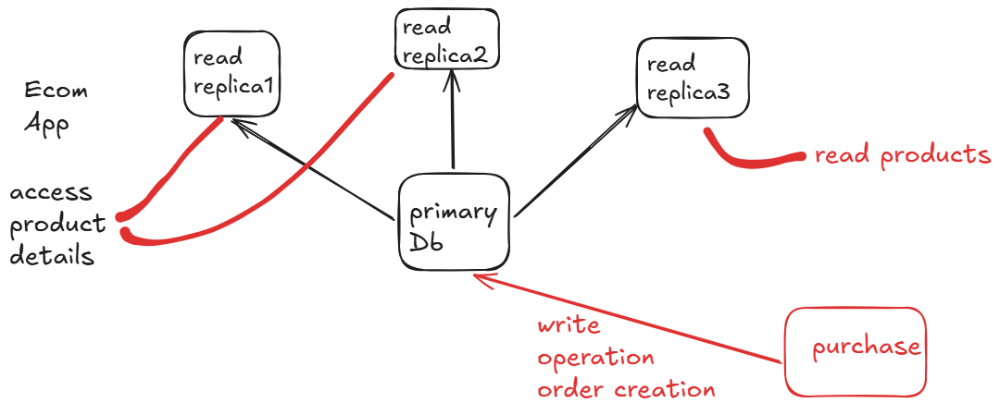

# AWS RDS

- managed databse service by AWS which helps you to create, setup, operate and scale RDS in cloud.

- no need to manully manage servers, backups, patches but everything will be managed by AWS

### Supported Dbs

- MySQL
- postgreSQL
- MariaDB
- oracle
- MS SQL Server



## Let's Do simple Setup of RDS

- AWS Console -> RDS -> Databases -> create database
- full configuration DB -> select mySQL 
- DB creation method: Easy Create
- MySQL community -> free tier
- root user admin
- password: give password
- create database

*check once Publically accessible if not enable it*

- modify -> additional setting and enable
 
## quick test

- create ec2 instance for ubuntu
- set up mysql-client and connect

```bash
sudo apt update
sudo apt instal MySQL-client-y
mysql -h endpoint -u admin -p
# prompt for password, enter password then press enter

```

### Read Replica

- read only copy of your Primary Database with continously sync with Primary DB
- good for High Performance, manage high traffic and reduce load of read queries from main DB

### How it works



- write operation (primary DB) - insert, update, delete
- read operations - read replicas - select, filter etc..

