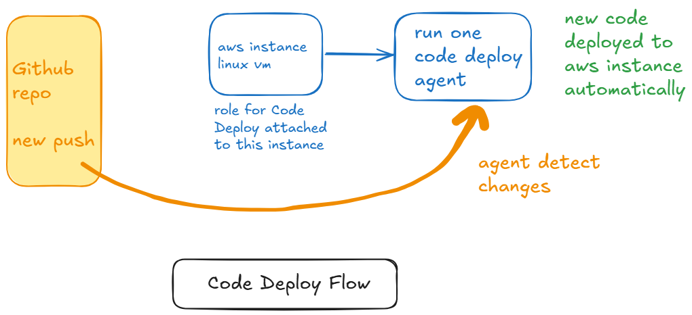
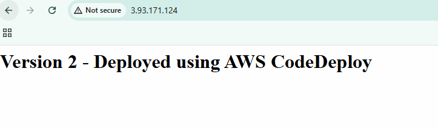

# CodeDeploy Works



- Create Amazon linux instance
 - name: codedeploy-demo

- Create role for EC2 Code deploy
    + Create Role -> AWS Service -> Select EC2 -> next
    + Attach policy
        - AmazonS3ReadonlyAccess
        - AWSCodeDeployFullAccess
    + name: EC2CodeDeployRole
    + create role

- Attach This created role to Amazon Linux instance
    + instance -> select -> Actions -> security
    + modify IAM role -> attach role which just created
    + Update I am role

- connect with EC2 instace using SSH
- Setup Code Deploy agent

[Reference Link](https://docs.aws.amazon.com/codedeploy/latest/userguide/codedeploy-agent-operations-install-linux.html)

```bash
sudo yum update
sudo yum install ruby
sudo yum install wget

#Chnage Home directory
cd /home/ec2-user

# install (change as per your region)
wget https://aws-codedeploy-us-east-1.s3.us-east-1.amazonaws.com/latest/install

chmod +x ./install
sudo ./install auto
systemctl status codedeploy-agent
```

*This Agent Listenes for deployment instructions from Code Deploy*

**Project**

- create Application Code just like below Github Repo

[Reference Code](https://github.com/sonam-niit/CodeDeployDemo.git)

- setup your project code (index.html)
- script (basically to start app)
- appspec.yml (this file connects code deploy)

### Configure Code Deploy

- AWS Console -> Search Code Deploy -> click on it
- you can see deploy option in side bar -> application
- create application:
    + app name: myapp
    + compute platform: EC2/On-premises
    + create app

**Create OneRole for CodeDeploy**

- IAM -> create Role -> AWS Service -> search for CodeDeploy
- select -> automatically it will have code deploy policy
- next -> name: CodeDeployServiceRole
- create Role

**Go to Prev created App under codedeploy**

- click on myapp
- create deployment group
- group name: myappdeploy
- select previously created Role ARN
- deployment type: Inplace
- environment configuration: select EC2 instance
- Key: Name
- Value: isntance name: (codedeploy-demo)

- install awscode agent: select now and schedule updates
- deselect load balancer
- create deployment group

## Create Deployment

- Click on create deployment
- select deployment group: myappdeploy
- select my application is stored in github
- type any token name (like your name)
- click on connect to github (authenticate)
- repo name: sonam-niit/CodeDeployDemo
- useraccount/repo-name
- create deployment

- access public IP in browser:
- you can see app deployed by code deploy on Ec2 instace




