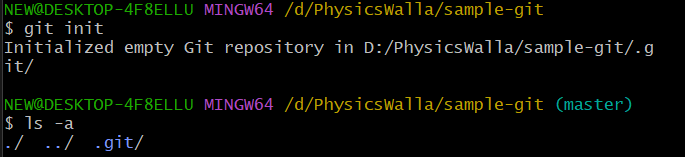
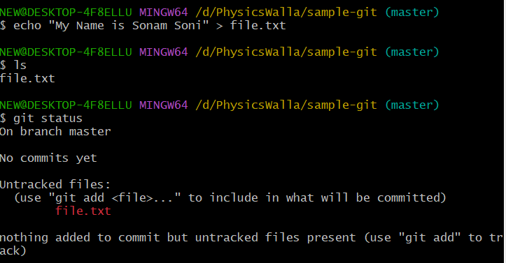
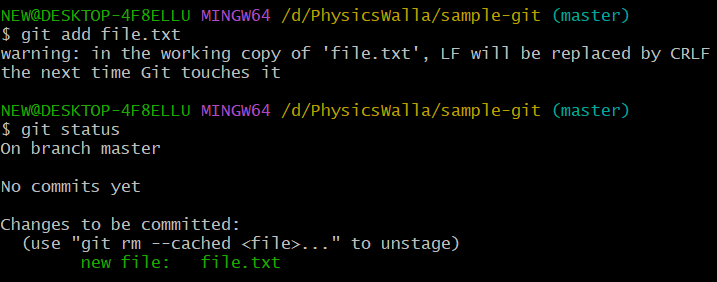
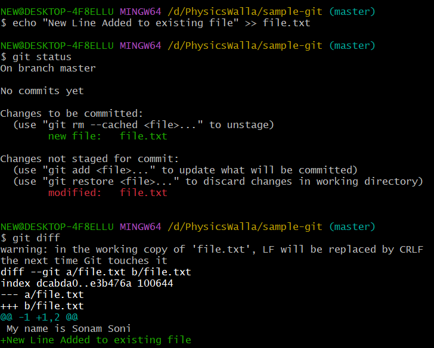
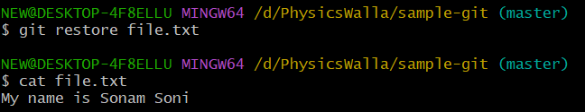
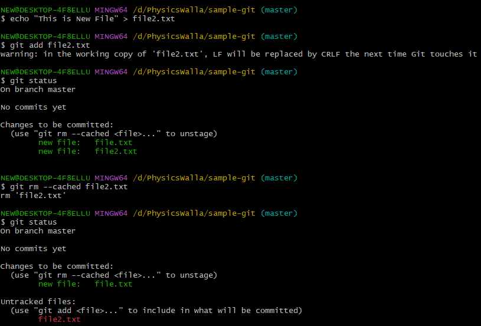
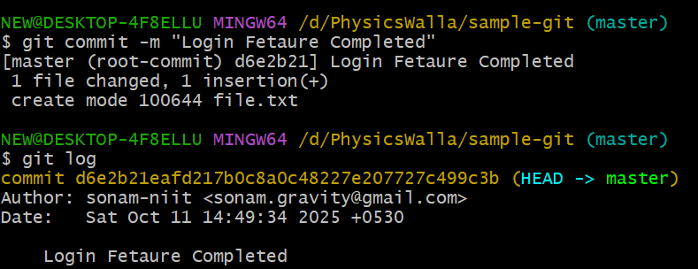
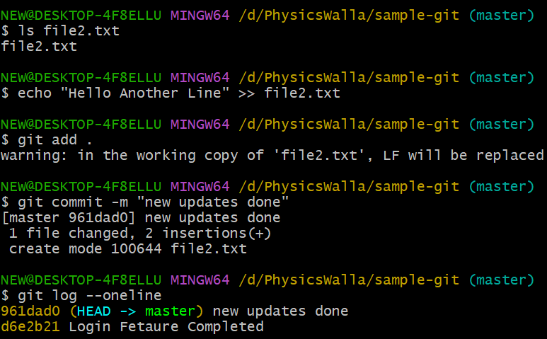

# Let's understand how git works

1. create folder named sample-git
2. open that folder inside gitBash
3. make this folder as repo run command: git init

4. By default When you intialize git it provided default branch as master branch.
5. Whatever you do its indicated that, work done from master branch.
6. Let's understand tracking

7. add in staging area and check status

8. Let's Modify and understand the changes using tracker

9. This changes you don't want then use restore
   - it Removes the changes from working directory and get the data back
   - from staging area

10. Stage and Unstage files

- unstage will just remove the file from staging area not from working directory

11. For commit first of all follow the config command if its not created
   - check 

12. Let's do the first Commit

13. You can make some changes to new file and stage it and commit it again.

   - now when you do git logs 2 can see 2 logs

