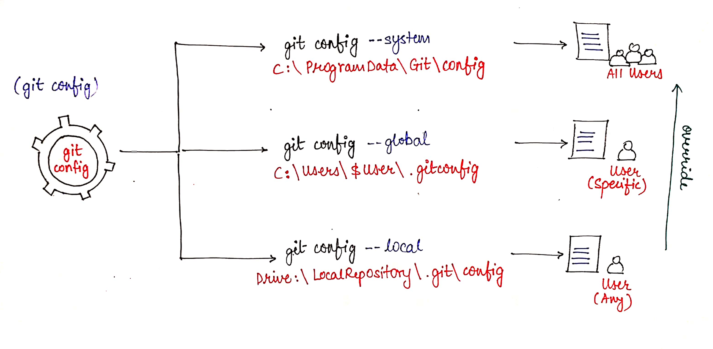
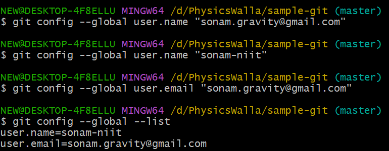

# Git Configuration

- We need to setup our GitHub Account on github.com
- this username and  email we need to configure locally to execute commit commands

- For Git Config we have git config command

- git config --global (I am logged in my system as sonam)
- sonam can access this config through out C:, D:, E: 

- git config --local (for folder wise)
- to set up seperate account for perticular project

- git config --system (for global access in system)
- in one com system we have 5 users, all users can have a access of this config



```bash
# Set Global Username:
git config --global user.name "Your Name"
# Set global Email:
git config --global user.email "you@example.com"
# Set global default editor
git config --global core.editor "code"
#Set global coloured output
git config --global color.ui auto
# Set global aliases: (Shortcuts)
git config --global alias.co checkout
git config --global alias.br branch
git config --global alias.ci commit
git config --global alias.st status
# View all configuration:
git config --global --list
```
