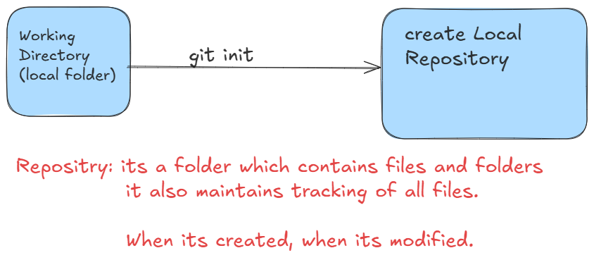

# Version Control With Git & GitHub

- Git is a Version Control System which is helping to maintain the versions of my application
- How to maintaine?
- download Git Software ? and then maintain locally?
- To provide it remotely with Colloborator then use GitHub 
- GitHub Provides Remote Repository to work with.

## How Git Works Locally?

- When you starts creating you code its maintained under the folder
- To track the files you have to make it repo
- to initialize blank repository use git init command
```bash
git init #it create empty repo
# how to verify: you can see one hidden .git folder 
# this folder tracks all the files 
```


## Git Work Flow

- once you have empty repo you can start adding your files in staging area for tracking
- to add in staging area you can use below command
```bash
git add filename # to add single file
git add foldername/ # to add entire folder
git add . # to add all the changes
```

- when you add files it started tracking by Git (its also called like file staged)

- once, its staged to add them into local repo use commit command

```bash
git commit -m "XYZ Feature completed" # -m for added message
```
- commit takes only those file which are staged not others which are in you working directory

- after commit you can push (push files from Local Repo to Remote Repo (GitHub))

```bash
git push # this will push only commited files to your Remote Reposiory
```

## Analogy For git WorkFlow

**Movie production Analogy**

- git add -> You select which scenes (changes) will go into movie
- git commit -> You edit and finalize the scenes into one cut (snapshot)
- git push -> You release the movie to audience (share to remote)

