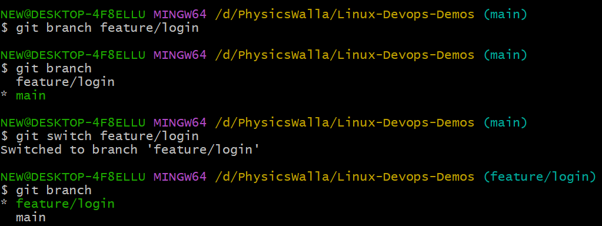
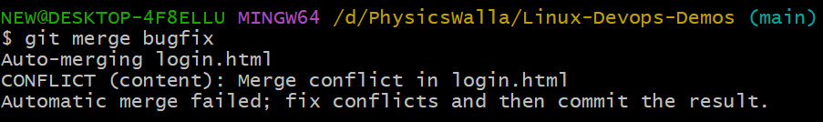

# Branching and Merging in Git

- When you are working in colloborative environment
- when you want to create some new feature
- when you want to fix bug of your application

- better to use extra branch work on it if all good then merge it with existing code

**How to create Branch**

- git branch branchname (this will just create branch)
- git switch -c branchname (it will create branch and switch me to that branch)
- git checkout -b branchname (it will create branch and switch me to that branch)


- create simple login.html file: nano login.html
- add below code:
```html
<!DOCTYPE html>
<html>
<head>
<title>Login Page</title>
</head>
<body>

<h1>Welcome To My Application</h1>
<p>Fill up the below Login Form.</p>

</body>
</html>
```
- stage the file: git add login.html
- commit: git commit -m "login fetaure done"
- check logs: git log --oneline
- switch branch: git switch main
- check log: git log --oneline (you can't see login log here)
- to merge: git merge fetaure/login (branch name)
- if there is not confliction it will merge quickly and then check log
- after using the branch if no need then delete them
- git branch -d feature/login (it will delete branch)

**Merge Conflict**

- create bugfix branch and switch to it: git switch -c bugfix
- edit login.html file and make some changes
```html
<h2>Login Form<h2>
<form>
</form>
```
- stage it: git add .
- commit : git commit -m "changes done from bugfix branch"

- switch back to main: git switch main

- again edit login file: nano login.html
```html
<h2>Welcome to Form<h2>
<h3>Please Fill up below form to Login</h3>
<form></form>
```
- stage it: git add .
- commit : git commit -m "changes done from main branch"

- now merge: git merge bugfix


- to resolve: open file in nano editor
- you can see both the changes coming from Head (main branch)
- and changes from Bugfix branch

- try to solve manually like what you want to keep 
- again save, stage, commit and push.