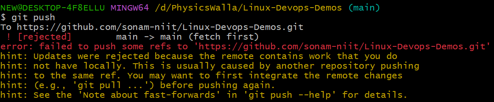
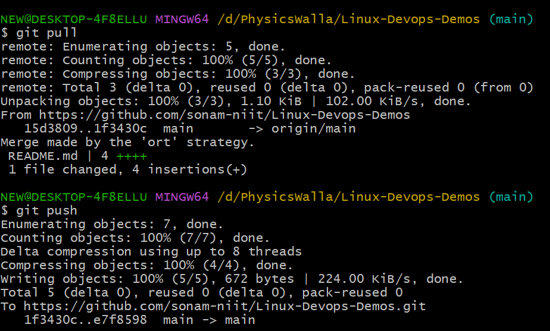

# Let's Understand How clone works

1. create a new Repo on Github
2. Enter Name, Description, Add ReadMe file 
3. Include GitIgnore and select language python
4. Create Repo

5. Once repo created copy repo link and go to your folder where you wnat to clone your application

6. Open CMD run command: git clone repo_link
7. It will clone your project.
8. Move to your Project: cd project-name
    - you can check existing commits: git log
    - you can check existing origin: git remote -v
9. edit the readme file
10. stage it: git add .
11. commit it: git commit -m "ReadMe updated"
12. git push -u origin main 

**Let's Understand Clone**

- First of all, in your repo from Github only try to edit readme file & commit
- go locally, add new text file, stage it, commit and push
- you can see error

- to resolve it first run pull command
- then run push command.
