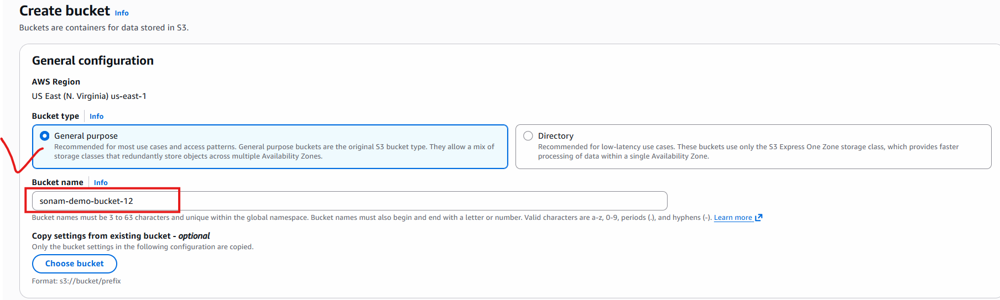
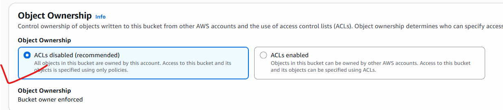
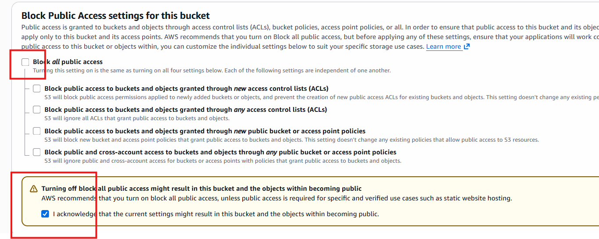
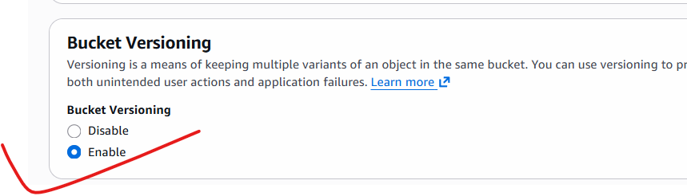
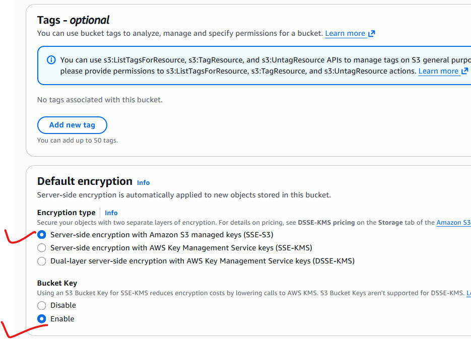
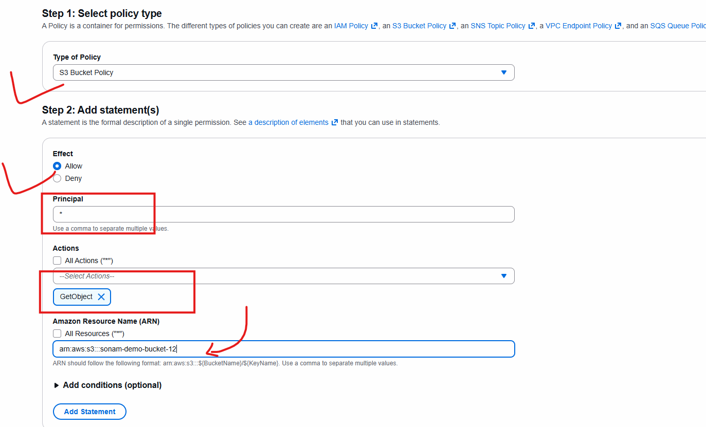
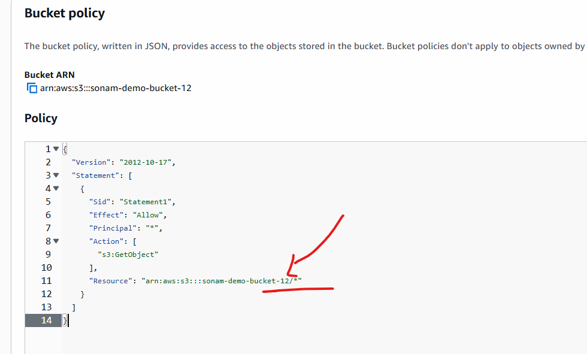
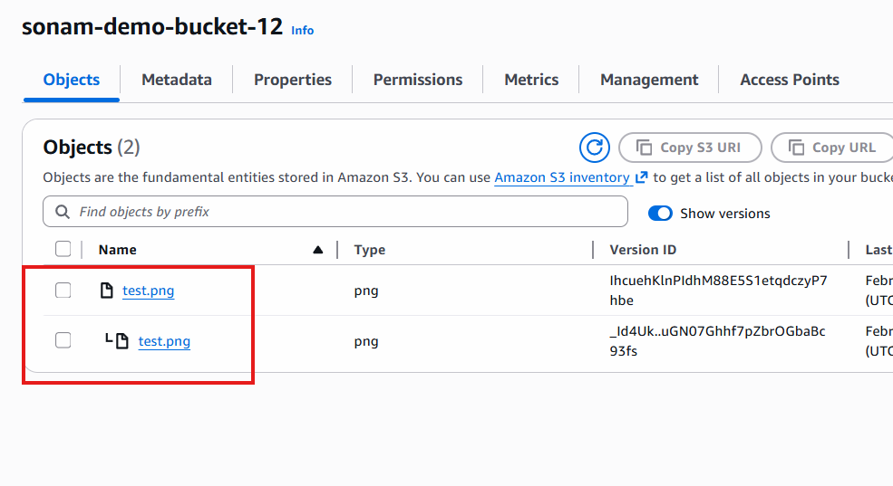

# Introduction to S3 bucket

- S3- S(Simple) , S(Storage), S(Service)
- Here i can store any kind of data, we can access it from anywhere.

1. Create S3 bucket:   
    - aws console --> search for S3 --> click on it
    - create bucket

- allow public access

- make sure you enable versioning

- default encryption

- click on create bucket

- once bucket is created - open it
- try to upload some image om it -> you can see its converted into obbject
- where you can see object details --> access URL but with that URL also image is not accessible

### How to access?

- using policy
- to generate policy use this link [Policy generator AWS](https://awspolicygen.s3.amazonaws.com/policygen.html)

- click add statement
- click on Generate Policy
- then copy code

- go to your bucket --> permissions --> add policy and then add

- after updating policy check object is accesible or not

## Versioning

- upload same name object again
- click on show version option in bucket you can see versions of uploaded images

### Static Website Hosting using S3 Bucket

- create some index.html, files and folder as static website
- upload inside s3 bucket root location

- s3 bucket --> properties --> scroll to last
- static website hosting -> enable
- file mention index.html
- save
- check url where website hosted

*To access this also getObject policy is required, we have already added that erlier that's why its accessible here*
