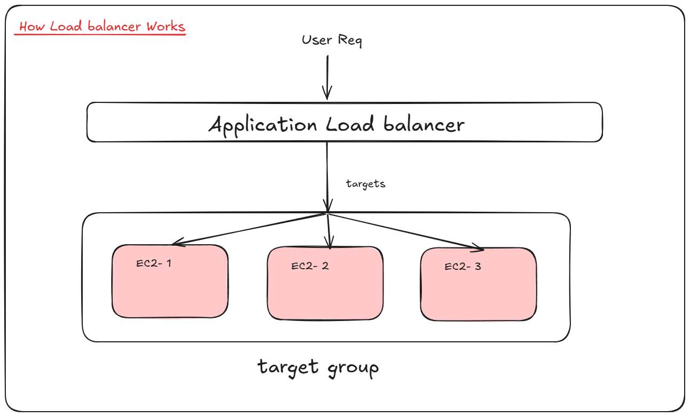

# implement ALB

- Application Load Balancer



- first we will create Ec2 instances
- Let's create 2 instances in differen subnets

- Ec2 -> ubuntu AMI -> t2. micro (type) -> Network (AZ- 1b and 1c)
- choose 2 diffrent zone
- security group -> use previously created with port 22,80 open
- storage same 8 GB -> Create

- Temporary output response we will start nginx server

```bash
sudo apt update && sudo apt install nginx -y

sudo systemctl enable nginx
sudo systemctl start nginx

echo "<h1>Hello From Server1</h1>" | sudo tee /var/www/html/index.html
# echo "<h1>Hello From Server2</h1>" | sudo tee /var/www/html/index.html
```

- for temporary verification you can check public ip in broswer for both instances.
- once both working then Let's create Target Groups

# Target Groups

- ec2 dashboard -> scroll down -> target group -> create target group
- select instances
- name: mytargetgroup
- protocol: tcp, port: 80
- Ipv4
- default VPC, keep default values to health check
- click on next

- select both instances and click on include as pending below.
- review required targets and then click on next
- check summary and create target group

# create load balancer

- again on ec2 dash -> check for load balancer
- create load balancer
- select ALB
- name: webapp
- select incernet facing, ipv4
- select default vpc and AZ (select 1b and 1c)
- select security group previously created
- listener, HTTP,80 
- select Targetgroup (select above createone)
- keep all other options by default
- create load balancer

- check the status of load balancer 
- is its active -> access DNS in browser with http so you cna see response coming from different instances.
- you can also target group status both insatance must be healthy