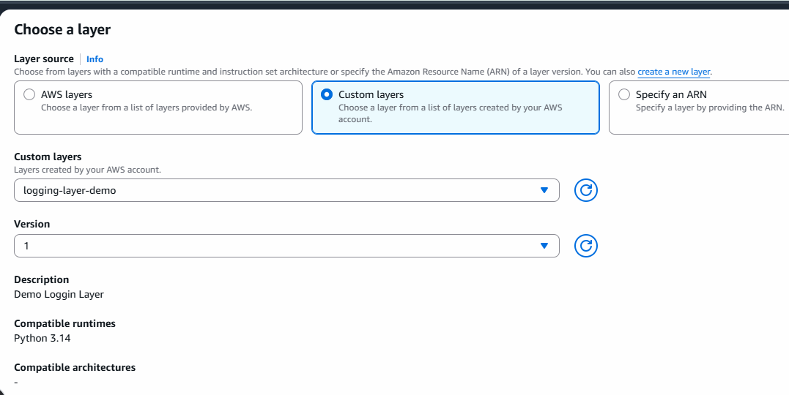

# lambda layers

- make reusability of code
- easy to manage libraries, dependencies and custom code across multiple lambda functions.
- when we are creating lambda functions each function can use upto 5 layers
- like own custom layers or thrird party libraries like pandas, numpy.

# let's implement custome code for logging

- create folder layers/python 
- create file logger.py add below code

```py
import logging
def get_logger(name="MyLambda"):
    logger= logging.getLogger(name)
    if not logger.handlers:
        handler= logging.StreamHandler()
        formatter = logging.Formatter(
            "%(asctime)s - %(name)s - %(levelname)s - %(message)s"
        )
        handler.setFormatter(formatter)
        logger.addHandler(handler)
        logger.setLevel(logging.INFO)
        
    return logger

# this is my reusable code
```
- move to the folder and zip it
```bash
cd layers
zip -r my-logging-layer.zip python/
```
- this is Something which i Wanted to use as layer

- go to AWS Lambda and layers and click on create layer
- name: logging-layer-demo
- description: Demo logging Layer
- select upload zip file
- also upload file zip file which we have created
- compatible runtime: select python
- create layer.

# Create functions to use this layer

- create lambda function:
- function from scrach: name: orderfuncion
- select python, default runtime value
- for role: go with default to get seperate logs for each labda function
- create function

- once function created click on layer option showing in center
- add layer


- after add make sure to save it.

- add below code

```py
import json
from logger import get_logger # imported from layer

logger = get_logger("Order Event")
def lambda_handler(event, context):
    logger.info("Processing Order Event")
    logger.debug(f"Event Details: {json.dumps(event)}")
    return {
        'statusCode': 200,
        'body': json.dumps('Order processed Successfully!')
    }

```

- try to test from lambda, you can add
- test data like: { "order_id": 101}

- same try to create Pyament Lambda function
- make sure to add layer of same function

```py
import json
from logger import get_logger # imported from layer

logger = get_logger("payment Event")
def lambda_handler(event, context):
    logger.info("Processing payment Event")
    logger.debug(f"Event Details: {json.dumps(event)}")
    return {
        'statusCode': 200,
        'body': json.dumps('payment processed Successfully!')
    }

- save test: { "payment_id" : 34567890}
- check logs in cloudwatch


# make sure to delete created resources.

