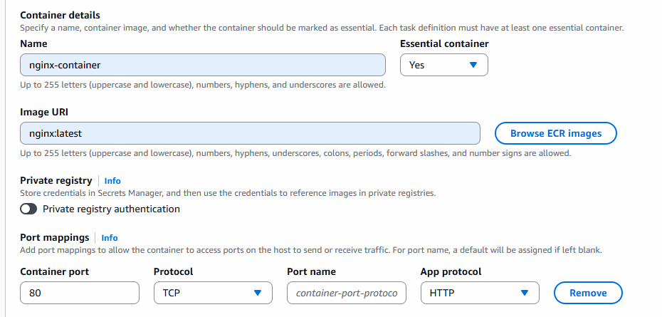

# ECS cluster and launch service

- AWS Console -> ECS - left side panel - search for clusters
- create cluster -> name: ecs-demo-cluster
- fargate only
- create cluster

## Open cluster

- once it is created you can click on cluster link
- go to left side panel and select task defination

*Task Defination is a blue print for your container, image,CPU,memory,ports*

- click on create new task defination
- task defination type: frontend
- launch type aws fargate
- os: linux
- cpu: .25vCPU, memory: 0.5GB
- task role: none
- Task Execution Create new Role: it will popup with defult req of role using that we can create use and select it here.

- keep other options as default and create 

## Go to Ec2 -> create target group

- select Ip address
- name: ecs-nginx-tg
- protocol: HTTP
- port: 80
- keep default options -> next -> next -> create

## create Load Balancer

- create ALB
- name: ecs-alb -> select internet-facing
- ipv4
- choose all availability zone
- security group also add default + yours where port 80 will be open
- forward target group and select target group which you have created above
- create load balancer.

## Create ECS Service

- click on service
- create service
- task defination family: frontend (select)
- revision: 1
- service name: nginx-task

- keep environment as it is
- deployment configuration: replica: 2
- keep all other options as it is
- expand load balancing option: enable
- use existing load balancer
- in target group select previously created target group
- use existing listener
- create

- once service created - open service and check for events
- you can see status of containers

*What is Happening here?*

- ECS launch fargate service
- assign ENI + private IP
- Register task to that IP
    + adding them target groups
    + perform health check

- try to open load balancer DNS in browser (see nginx default page)

## Make sure to delete resources

- delete service
- delete cluster
- de register task-defination
- delete task defination
- delete load balancer and target group

